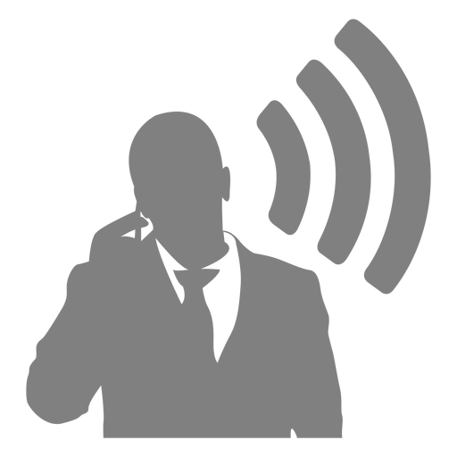

# V2K Booster

<div style="border-style: solid; border-width: thin; border-color: lightgrey;" align="center" width="100%">
    
    <h3>Boost v2k recordings to an intelligible level</h3>
</div>

## Methodology

After a failed attempt (see: [keeptalking](https://github.com/subliminalindustries/keeptalking)) research continued and a working method was found.

This tool is the spiritual successor to keeptalking and uses [harmonic salience](https://librosa.org/doc/latest/generated/librosa.salience.html) and the smoothed derivative of the instantaneous frequency calculated from the [Hilbert transform](https://docs.scipy.org/doc/scipy/reference/generated/scipy.signal.hilbert.html) to make v2k recordings audible and intelligible.

### Usage

v2kbooster accepts a glob pattern:

```
./v2kbooster.py /path/to/files/\*\*/\*.wav
```

Note the escaped `*` characters, this is to prevent shell-expansion of the pattern before it is fed into the program.

You can specify the number of FFT bins to use:

```
./v2kbooster.py -f 2048 /path/to/files/\*\*/\*.wav
```

You can additionally specify the weights for the harmonics:

```
./v2kbooster.py -w 1. .7 .4 .15 -f 4096 /path/to/files/\*\*/\*.wav
```

### Example

The input file below is an example of a recording of the reflected soundwaves caused by the Microwave Auditory Effect, also known as the microwave-induced thermoacoustic effect. The output file shows the effect of this program.

**input:** 

**output:** 

The input file was captured using the paid version of the Hear-Boost app ([Apple App Store](https://apps.apple.com/en/app/hear-boost-recording-ear-aid/id1437159134), [Google Play Store](https://play.google.com/store/apps/details?id=com.audiofix.hearboost)) which is excellent at recording the audio spectrum components of the Microwave Auditory Effect. The settings used in Hear-Boost were: Volume Boost: 200x, Device Mic: On, Voice Filter: Off.

Those using a Mac with Apple Silicon (M1/M2) can run HearBoost on their Mac.

While recording using this app sure to turn your audio output volume down 100% to prevent runaway microphone feedback.